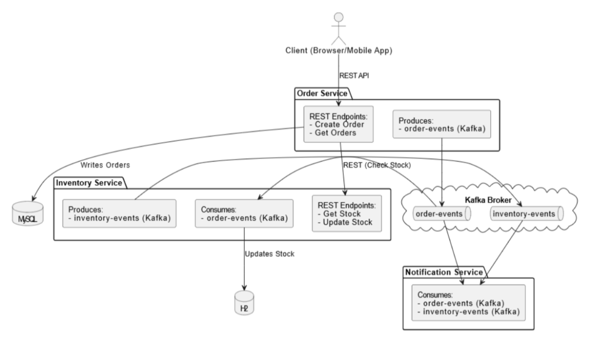

# SA_project
# Order Management System

## Overview
A microservices-based architecture for handling e-commerce orders, managing inventory, and sending notifications.

## Services
- **Order Service**: Handles order creation and events.
- **Inventory Service**: Manages stock levels and inventory updates.
- **Notification Service**: Sends notifications for orders and inventory changes.

## Architecture


## Setup Instructions
**Setup Instructions**

1. **Clone the Repository**:
   ```bash
   git clone https://github.com/dobrediana99/SA_project.git
   cd SA_project
   ```

2. **Build the Project**:
   Use Maven to build the project and resolve dependencies.
   ```bash
   mvn clean install
   ```

3. **Run the Application**:
   Start the Spring Boot application using Maven.
   ```bash
   mvn spring-boot:run
   ```
   Alternatively, you can run the generated jar file:
   ```bash
   java -jar target/SA_project-0.0.1-SNAPSHOT.jar
   ```

4. **Access the Application**:
   Open your web browser and navigate to `http://localhost:8080` to interact with the System.


